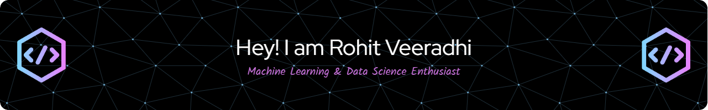

<!-- <h1 align="center">Hi 👋, I'm Rohit</h1>
<h2 align="center">Machine Learning &amp; Data Science Enthusiast</h2> -->
<h4>An aspiring enthusiast in Data Science and Machine Learning, driven by a passion for transforming innovative concepts into tangible solutions through coding. Passionate about working on solutions that integrates software technologies with existing solutions in various industries making them efficient and easy to use. I have often enjoyed working up, building things from scratch, and taking that forward to a monetizable real-world product.  Currently enrolled in a Master’s program in Electrical Engineering with a specialization in Machine Learning and Data Science at USC, I&#39;m keen on gaining hands-on experience in the dynamic realm of software development and machine learning.</h4>

### 📈 My GitHub Stats
<div style="display: flex;" align="center">
     
     
</div>

<br/>
<div style="display: flex;" align="center">
     
</div>

<!-- TECHNOLOGIES -->
<h3>:zap: Technologies</h3>

<p>
                  
</p>

<!-- SOCIAL -->
<h3>:milky_way: Find me</h3>

<p align="center">
    <a href="https://github.com/Rohit04121998" target="_blank">
        
    </a><a href="https://www.linkedin.com/in/rohit-veeradhi/" target="_blank">
        
    </a>
</p>

<hr />

<!-- GitHub profile viewers and visitors -->
<p align="center">
    
    
</p>

<!-- FOOTER -->
<!--START_SECTION:waka-->

```txt
No activity tracked
```

<!--END_SECTION:waka-->
<p align="center">
    This <i>README</i> file is generated <b>every 24 hours</b>!</br>
    Last refresh: 00:42:14 GMT+0000 (Coordinated Universal Time)<br />
</p>
<!-- <p align="center">
     
     
    
</p> -->

